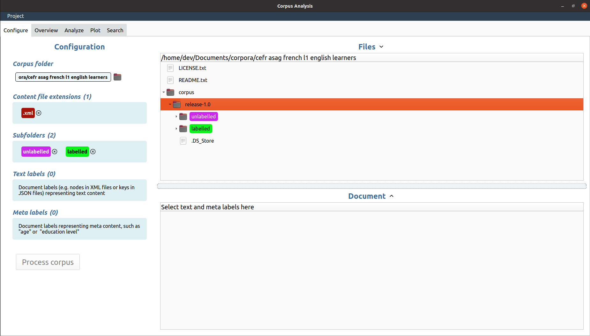
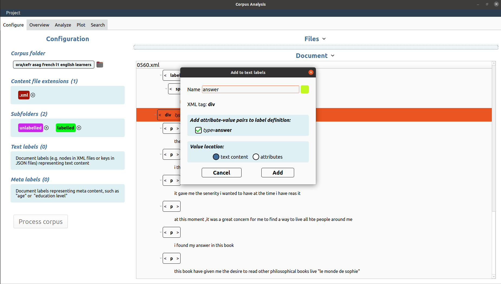
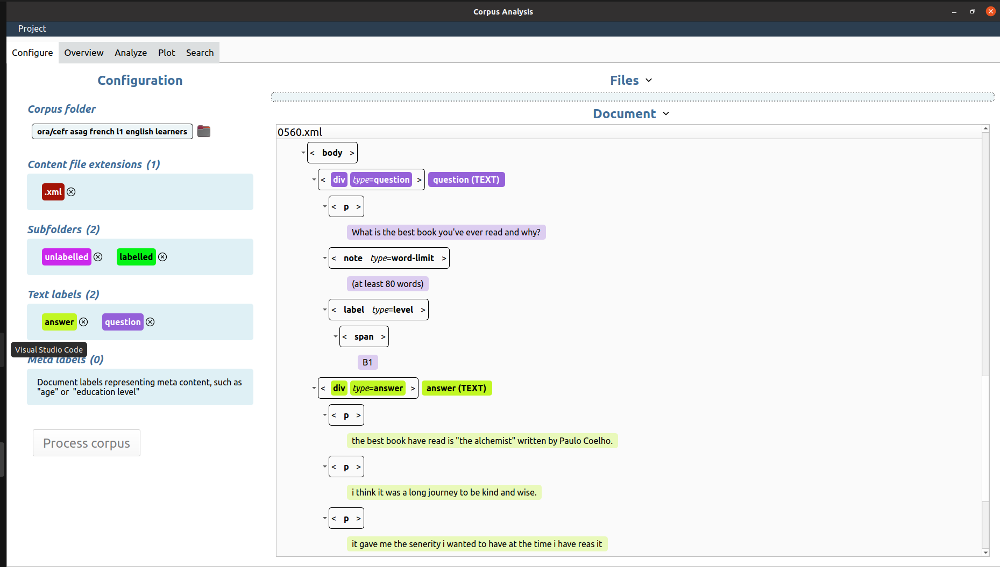
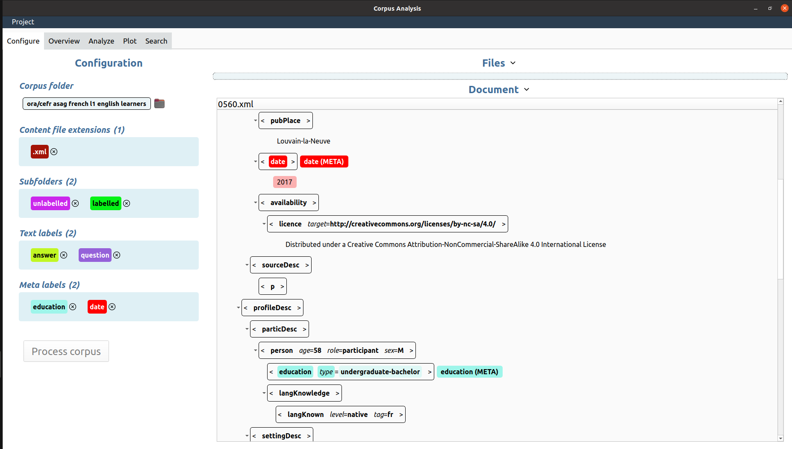
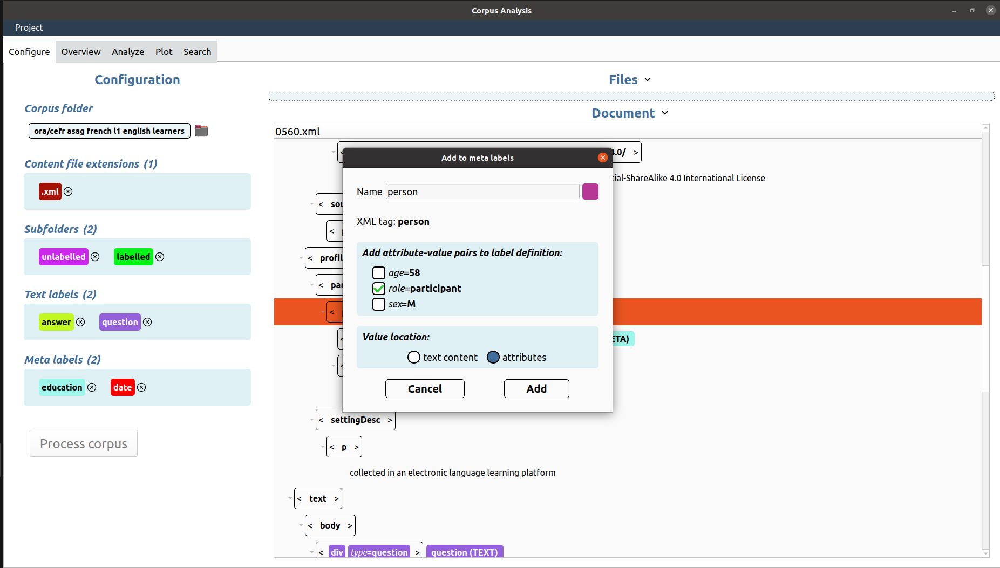
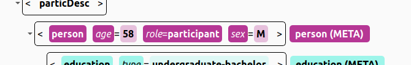
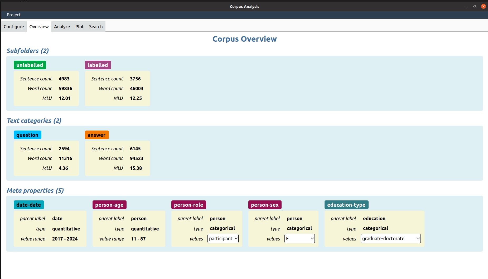
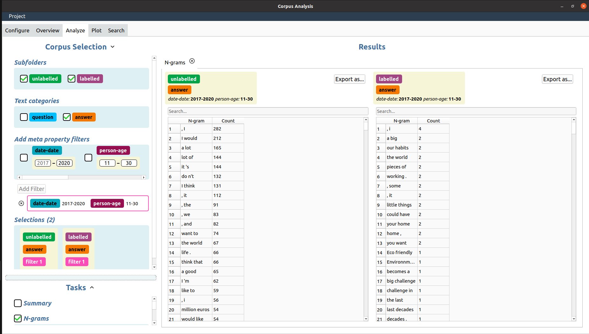
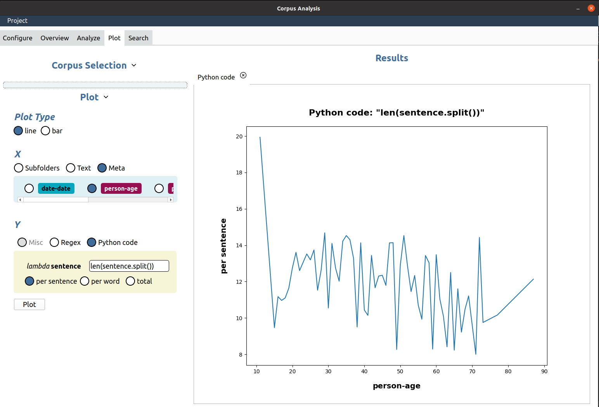

# Corpus Tools

## Overview

This is a gui tool for analyzing text corpora. It's still in development and currently only supports corpora with files in XML/HTML/JSON and CHA (CHILDES) file formats. Just select a corpus folder, configure the corpus (see below), click the process button, and the corpus will be processed and stored in an SQLite database for analysis.

## Installation

(v1.0 will be a packaged executable)

1. Get Python (3.11 or greater)
2. Create a virtual environment
3. Run `pip -r install requirements.txt`
4. Navigate to src folder and run `app.py`

## Usage

### 1. Corpus Configuration

<b>Select the corpus folder.</b> A file tree will appear showing the contents of the folder. Right-click on files/folders to select 1) file extensions to include in the analysis 2) subfolders to analyze separately.

<b>Double-click a corpus file to annotate it.</b>

<i>Note:</i> For .CHA files, text and meta content will be extracted from the files automatically.

Select labels (nodes/JSON keys) that correspond to text content. For XML/HTML nodes, you can add any attribute/value pairs to the label definition that correctly identify the relevant content. In the example below, the attribute <b>type</b> with the value <b>answer</b> is added to the label definition, because not all <b>div</b> because the tags `
` (and not other <b>div</b> tags) correspond to text content in the corpus files. You can specify multiple text labels. In the example below, labels identifying questions and answers are specified.

 

You can also select labels that identify meta content (such as age/gender/eduction level, etc.). The value of the label can be in the text content or (for XML/HTML files) in the attributes. In the example, below, the value of the <b>date</b> label is in the text content, and the value of the <b>education</b> label is in the attributes (specifically the <b>type</b> attribute)

Multiple `Meta properties`can be yielded from a single meta label if the value is in the attributes. In the example above, <b>education-type</b> is yielded from the label. In the example below, <b>person-age</b> and <b>person-sex</b> are yielded from the label. <b>role=participant</b> is used to identify the label, distinguishing it from <b>person</b> tags with other <b>role</b> values.

 

You only need to specify each text or meta-label once. They will automatically be detected in the rest of the corpus.

<b>Click the "Process" button to proccess the corpus based on the provided configuration.</b> All sentences in the text content will be tokenized and associated with their corresponding `text categories` and `meta properties`

### 2. Corpus overview

The overview tab displays summary info for the specified `subfolders`, `text categories` and `meta properties`. `Meta properties` are automatically classified as quantitative or categorical, and the range/list of values are displayed.

### 3. Analyze

Run analyses in this tab. Use the `corpus selection` tool to select different subsets of the corpus to analyze. You can specify subsets by `text category`, `subfolder` or different combinations of `meta property` filters. In the example below, two selections are made: for each subfolder, the <b>answers</b> text category where the <b>date</b> is between 2017-2020 and the <b>age</b> is between 11 and 30.

### 4. Plot

Plot values on this tab. Select an X value (`subfolders`, `text categories` or a `meta property`) and a Y value (currently regex or a Python function applied to each sentence). Below is a plot of MLU (mean length of utterance) by age.

### 5. Search

Search corpus contents using semantic search or regex.

## Future work

-   Functionality for more file types
-   Automatic processing of the corpus (automatic detection of text and meta content )
-   More analysis tasks and the ability to load custom Python scripts
